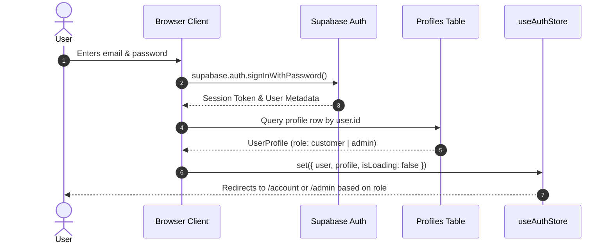
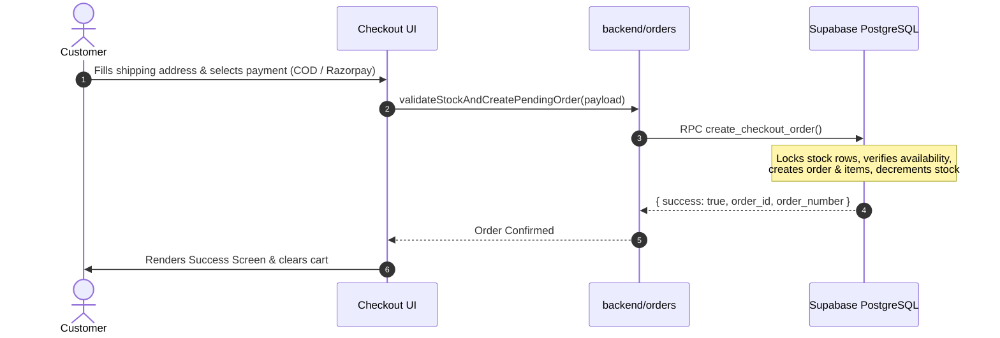

# Baby Ladoo | Curated Baby & Kids Essentials E-Commerce Storefront

A high-performance, fullstack modern e-commerce web platform built with **Next.js (App Router)**, **TypeScript**, **Tailwind CSS v4**, **Zustand**, and **Supabase (PostgreSQL & Auth)**.

🌐 **Live Deployment**: [https://ecommerce-site-dun-phi.vercel.app/](https://ecommerce-site-dun-phi.vercel.app/)

---

## 1. Project Overview
Baby Ladoo is a curated baby and kids essentials e-commerce destination designed with a warm, playful aesthetic (linen cream, deep navy, soft coral, sage, and sky pastel palettes). The platform provides a seamless shopping experience for customers (product catalog, multi-criteria filtering, cart persistence, wishlist synchronization, guest & authenticated checkout, order tracking) alongside a protected administrative management portal (product CRUD, inventory tracking, order status updates, store settings, and customer metrics).

---

## 2. Technology Stack

- **Framework**: [Next.js 16](https://nextjs.org/) (App Router, Server Components & Client Components)
- **UI & Styling**: [Tailwind CSS v4](https://tailwindcss.com/), [Lucide React](https://lucide.dev/) Icons, Google Fonts (`Quicksand`, `Nunito`)
- **Language**: [TypeScript](https://www.typescriptlang.org/) (Strict Mode)
- **Client State**: [Zustand](https://github.com/pmndrs/zustand) with LocalStorage persistence
- **Backend & Database**: [Supabase](https://supabase.com/) (PostgreSQL 15, Auth, Row Level Security, Storage)
- **Validation**: [Zod](https://zod.dev/) for type-safe runtime validations
- **Payments**: Razorpay HMAC-SHA256 verification and Cash on Delivery (COD)

---

## 3. Architecture

The codebase follows a clean, professional two-part modular architecture:
- **`src/frontend/`**: Encapsulates all customer-facing and administrative UI components, client state stores, client utilities, client-safe types, and browser-safe Supabase SDK.
- **`src/backend/`**: Encapsulates all server-only business logic, server session validation, role authorization, atomic order transactions, inventory management, Razorpay HMAC signature verification, and elevated admin services.
- **`src/app/`**: Next.js App Router entry points (pages, layouts, and API route handlers) acting as thin HTTP controllers routing requests to frontend UI components and backend domain services.

```
project/
│
├── src/
│   ├── app/                    # Next.js App Router (Routes, Layouts, API Handlers)
│   │   ├── (customer routes)   # /, /products, /products/[id], /cart, /checkout, /account, /wishlist, etc.
│   │   ├── admin/              # Protected admin portal routes (/admin, /admin/products, /admin/orders, etc.)
│   │   ├── api/                # Next.js HTTP API route handlers
│   │   ├── auth/callback/      # Supabase OAuth/PKCE/Magic Link callback route
│   │   ├── globals.css         # Tailwind CSS tokens, theme variables, custom animations
│   │   └── layout.tsx          # Root HTML layout with Google fonts and global providers
│   │
│   ├── frontend/               # Presentation & Client-side UI layer
│   │   ├── components/         # Reusable React components
│   │   │   ├── admin/          # AdminGuard, ProductFormModal
│   │   │   ├── auth/           # AuthListener
│   │   │   ├── common/         # CartoonIllustrations, mascot badges
│   │   │   ├── layout/         # Header, Footer, MobileMenu
│   │   │   └── products/       # ProductCard, PincodeChecker
│   │   ├── store/              # Zustand state stores
│   │   │   ├── useAuthStore.ts     # User session & profile state
│   │   │   ├── useCartStore.ts     # Shopping cart items, counts, calculations
│   │   │   └── useWishlistStore.ts # Wishlist IDs & products synchronization
│   │   ├── lib/                # Client-safe libraries & utilities
│   │   │   ├── supabase/       # Browser-safe client (client.ts, wishlist.ts)
│   │   │   ├── constants.ts    # Filter categories & UI configuration
│   │   │   └── utils.ts        # Tailwind merge & className utility (cn)
│   │   └── types/              # Client-safe TypeScript type definitions
│   │       ├── product.ts
│   │       ├── order.ts
│   │       ├── user.ts
│   │       ├── settings.ts
│   │       └── wishlist.ts
│   │
│   └── backend/                # Server-only domain services & business logic
│       ├── auth/               # Server session retrieval & role verification (auth.ts)
│       ├── products/           # Product queries, admin catalog management, stats (products.ts)
│       ├── orders/             # Order creation, stock reservation, status updates (orders.ts)
│       ├── payments/           # Razorpay HMAC signature verification & payment status (razorpay.ts)
│       ├── services/           # Server Supabase clients, Storage uploads, Store settings
│       │   ├── supabase.ts     # SSR client (cookies) & elevated Service-Role client
│       │   ├── storage.ts      # Product image storage operations
│       │   └── settings.ts     # Store settings persistence
│       ├── validation/         # Zod schemas for input validation
│       │   ├── checkout.ts     # Checkout address & cart validation schema
│       │   └── product.ts      # Product create/update validation schema
│       └── types/              # Backend response interfaces & shared types
│
├── supabase/
│   ├── migrations/             # SQL schema migrations with RLS policies & triggers
│   └── functions/              # Edge functions
│
├── public/                     # Static media & illustrations
├── .env.local                  # Environment variables
├── next.config.ts              # Next.js configuration
├── tsconfig.json               # TypeScript path alias configuration (@/frontend, @/backend)
└── package.json
```

---

## 4. Frontend Structure (`src/frontend/`)

- **`components/`**: Modular, isolated UI components with accessible ARIA tags and responsive breakpoints.
  - `admin/AdminGuard.tsx`: Client-side protection boundary checking for authenticated user and `admin` role.
  - `admin/ProductFormModal.tsx`: Comprehensive product creation & editing modal with image uploads.
  - `auth/AuthListener.tsx`: Global auth state listener syncing Supabase session with Zustand store.
  - `layout/Header.tsx` & `Footer.tsx`: Navigation bar with cart badge, search, user dropdown, trust bar, and legal links.
  - `products/ProductCard.tsx`: Interactive product card with hover animations, stock badges, and wishlist toggle.
  - `products/PincodeChecker.tsx`: Indian pincode delivery estimation widget.
- **`store/`**: Lightweight Zustand stores leveraging `localStorage` for cart persistence across browser reloads.
- **`lib/`**: Client utilities and browser-safe Supabase client configured with public publishable keys only.
- **`types/`**: Canonical type contracts for products, cart items, orders, user profiles, and settings.

---

## 5. Backend Structure (`src/backend/`)

- **`auth/`**: Server-side profile resolution (`getCurrentUserProfile`), role validation (`verifyAdminRole`), and automatic user provisioning (`ensureUserProfile`).
- **`products/`**: Server queries for active product listings with category/price/age filtering, admin catalog queries, and dashboard metric calculations.
- **`orders/`**: Stock validation, human-readable order number generation (`ORD-YYYY-XXXX`), atomic checkout via PostgreSQL RPC `create_checkout_order`, order lookups, and admin status updates.
- **`payments/`**: Cryptographic HMAC-SHA256 signature verification using `RAZORPAY_KEY_SECRET` and payment status transitions (`pending` → `paid` → `confirmed`).
- **`services/`**: Server-side Supabase client (`getServerSupabaseClient`) managing cookies via `@supabase/ssr` and elevated admin client (`getAdminSupabaseClient`) enforcing strict failure if `SUPABASE_SERVICE_ROLE_KEY` is absent.
- **`validation/`**: Strict Zod schemas validating customer checkout payloads, shipping addresses (6-digit Indian PIN codes, 10-digit mobile numbers), and product inputs.

---

## 6. Supabase Structure (`supabase/`)

Database schema migrations are organized chronologically in `supabase/migrations/`:
1. `01_create_profiles.sql`: User profiles table, `handle_new_user()` sign-up trigger, `is_admin()` helper, and storage bucket setup.
2. `02_create_products.sql`: Products table with full metadata attributes, stock tracking, and RLS policies.
3. `03_create_orders.sql`: Orders & order items tables, atomic `create_checkout_order` RPC, and guest token verification `get_guest_order_by_token` RPC.
4. `04_create_store_settings.sql`: Store settings key-value store with public read access and admin-only mutations.
5. `05_create_wishlist.sql`: User wishlists table with unique `(user_id, product_id)` constraint and cascade deletes.
6. `06_auth_helpers.sql`: Safe `check_user_exists_by_email` function for password reset validations.

---

## 7. Authentication Flow



---

## 8. Customer vs. Admin Role Flow

- **Single Shared Authentication**: Both customers and administrators authenticate via the same unified Supabase Auth service.
- **Role Detection**: The `profiles.role` column (`customer` | `admin`) determines permissions.
- **Customer Experience**:
  - Displays customer navigation bar with cart and wishlist.
  - Allows browsing active products, adding items to cart, checking out, and viewing personal orders.
  - Admin controls and edit buttons are hidden from the UI.
- **Admin Experience**:
  - Access to `/admin` dashboard, product catalog management, order status management, and store settings.
  - Protected at the UI layer by `AdminGuard` and at the database layer via `public.is_admin()` RLS policies.

---

## 9. Product Management Flow

- **Customer Product Flow**:
  1. Customer visits `/products` or filters by category/age/price.
  2. Queries `products` table where `is_active = true`.
  3. Customer clicks product card to view detailed specifications on `/products/[id]`.
  4. Customer selects size/color and adds item to cart.
- **Admin Product Flow**:
  1. Admin navigates to `/admin/products`.
  2. Views all active and inactive products.
  3. Can create a new product, upload product images to Supabase Storage (`products` bucket), edit metadata, toggle active/inactive status, or delete products.

---

## 10. Order Processing Flow



---

## 11. Payment Flow

- **Cash on Delivery (COD)**:
  - Order is placed immediately in `pending` payment status and `pending` order status.
- **Online Payment (Razorpay)**:
  - Frontend initializes Razorpay checkout modal with order details.
  - Customer completes payment on Razorpay.
  - Response (`razorpay_order_id`, `razorpay_payment_id`, `razorpay_signature`) is sent to the backend.
  - Backend verifies HMAC SHA256 signature using secret `RAZORPAY_KEY_SECRET`.
  - Upon valid signature verification, payment status updates to `paid` and order status advances to `confirmed`.

---

## 12. Database Schema & Tables

| Table Name | Primary Key | Key Columns | Description |
| :--- | :--- | :--- | :--- |
| `profiles` | `id` (UUID, FK to `auth.users`) | `name`, `email`, `phone`, `role` | User accounts with role-based access control |
| `products` | `id` (UUID) | `name`, `category`, `price`, `mrp`, `discount`, `stock`, `images`, `is_active` | Complete product catalog and inventory counts |
| `orders` | `id` (UUID) | `order_number`, `user_id`, `total`, `payment_status`, `order_status`, `shipping_address` | Master order transactions |
| `order_items` | `id` (UUID) | `order_id`, `product_id`, `product_name`, `purchase_price`, `quantity`, `total` | Snapshot item records per order |
| `store_settings` | `id` (TEXT, `'default'`) | `store_name`, `contact_email`, `contact_phone`, `shipping_fee`, `free_shipping_threshold` | Storewide configuration values |
| `wishlists` | `id` (UUID) | `user_id`, `product_id` | Customer saved items with unique constraint |

---

## 13. RLS & Security Model

- **Row Level Security (RLS)** is enabled on all 6 database tables:
  - **`products`**: Public users can only `SELECT` where `is_active = true`. Only authenticated admins (`public.is_admin()`) can `INSERT`, `UPDATE`, or `DELETE`.
  - **`profiles`**: Users can `SELECT` and `UPDATE` only their own profile row (`auth.uid() = id`). Role modifications are restricted. Admins can view all profiles.
  - **`orders`**: Customers can only view their own orders (`auth.uid() = user_id`). Direct `UPDATE` or `DELETE` is restricted to admins only.
  - **`order_items`**: Read access is granted only if the parent order belongs to the user or if the user is an admin.
  - **`store_settings`**: Publicly readable; editable strictly by admins.
  - **`wishlists`**: Customers can only `SELECT`, `INSERT`, and `DELETE` items matching their own `auth.uid()`.
- **Zero Client Secret Exposure**: `SUPABASE_SERVICE_ROLE_KEY` and `RAZORPAY_KEY_SECRET` are never referenced or bundled into browser assets.

---

## 14. Environment Variables

Create a `.env.local` file in the project root:

```env
# ==============================================================================
# Client-Safe Environment Variables (Exposed to Browser)
# ==============================================================================
NEXT_PUBLIC_SUPABASE_URL=https://your-project.supabase.co
NEXT_PUBLIC_SUPABASE_PUBLISHABLE_KEY=your-supabase-anon-or-publishable-key
NEXT_PUBLIC_SUPABASE_ANON_KEY=your-supabase-anon-key
NEXT_PUBLIC_SITE_URL=http://localhost:3000

# ==============================================================================
# Server-Only Environment Variables (NEVER expose to frontend)
# ==============================================================================
SUPABASE_SERVICE_ROLE_KEY=your-supabase-service-role-secret-key
RAZORPAY_KEY_ID=your-razorpay-key-id
RAZORPAY_KEY_SECRET=your-razorpay-key-secret
```

---

## 15. Local Development Guide

### 1. Clone the repository
```bash
git clone https://github.com/meet-siteapps/ecomm.git
cd ecomm
```

### 2. Install dependencies
```bash
npm install
```

### 3. Configure environment
Create `.env.local` and populate the required Supabase credentials.

### 4. Start local development server
```bash
npm run dev
```
Open [http://localhost:3000](http://localhost:3000) in your browser.

---

## 16. Production Deployment (Vercel)

1. Push your repository to GitHub.
2. Import the repository in [Vercel Dashboard](https://vercel.com/dashboard).
3. Set the Framework Preset to **Next.js**.
4. In **Settings > Environment Variables**, add all environment variables from Section 14.
5. Deploy the application.

---

## 17. GoDaddy → Vercel Custom Domain Setup

1. In your **Vercel Dashboard**, navigate to **Settings > Domains** and add your domain (e.g. `babyladoo.com`).
2. Log in to [GoDaddy DNS Management](https://dcc.godaddy.com/manage-dns) for your domain.
3. Add or update the following DNS records:

| Type | Name | Value / Points To | TTL |
| :--- | :--- | :--- | :--- |
| **A** | `@` | `76.76.21.21` | 1/2 Hour (600s) |
| **CNAME** | `www` | `cname.vercel-dns.com` | 1/2 Hour (600s) |

4. Wait for DNS propagation. Vercel will automatically verify the records and issue a free SSL certificate.

---

## 18. Supabase Production Configuration

1. In your **Supabase Dashboard**, navigate to **Authentication > URL Configuration**.
2. Set the **Site URL** to your production domain (e.g. `https://babyladoo.com` or `https://ecommerce-site-dun-phi.vercel.app`).
3. Under **Redirect URLs**, add:
   - `https://your-domain.com/**`
   - `https://your-domain.com/auth/callback`
   - `http://localhost:3000/**` (for local development)
4. Verify under **Storage > Buckets** that the `products` bucket is set to **Public**.

---

## 19. Testing & Quality Checklist

- [x] **TypeScript Build**: `npm run build` passes with 0 errors across all 27 App Router routes.
- [x] **Storefront Navigation**: Home, Products, Product Detail, Cart, Checkout, Wishlist, Legal pages render flawlessly.
- [x] **Product Filtering**: Category, age group, price range, and search filters operate with zero latency.
- [x] **Authentication**: Sign-up, Sign-in, Sign-out, and session persistence verified.
- [x] **Admin Protection**: `/admin` routes reject unauthenticated and customer accounts, allowing access only to admin accounts.
- [x] **Order Creation**: Stock validation, atomic reservation, and order confirmation working as expected.
- [x] **Secret Isolation**: Server secrets (`SUPABASE_SERVICE_ROLE_KEY`, `RAZORPAY_KEY_SECRET`) are strictly isolated to server-side execution.

---

## 20. Known Limitations & Best Practices

1. **Email Rate Limits**: Default Supabase Auth SMTP has strict hourly rate limits for sign-up emails. For high-volume production use, configure a custom SMTP provider (SendGrid, Resend, or AWS SES) in Supabase.
2. **Payment Gateway Credentials**: When enabling live online payments, ensure Razorpay Test keys are replaced with Razorpay Live keys in your production environment variables.